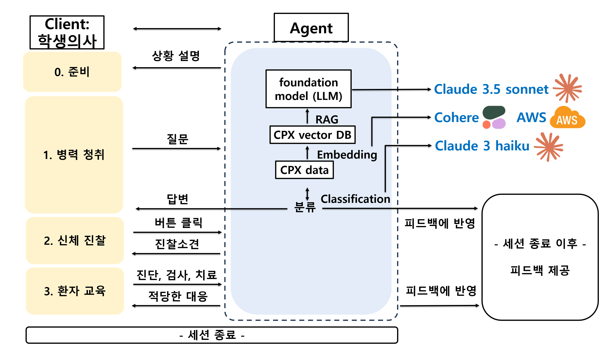

# CLAP - 의대생 CPX 준비를 위한 AI 기반 어노테이션 툴

**CLAP**은 의대생들이 CPX(Clinical Performance Examination) 준비를 돕기 위해 개발된 오픈소스 어노테이션 툴입니다. ChatGPT와 같은 대형 언어 모델(LLM)을 활용하여, 학생들이 실습 파트너나 모의 환자 없이도 연습할 수 있는 환경을 제공합니다.

## 프로젝트 소개


### 해결하고자 하는 문제:
- **파트너 매칭 어려움**: 실습을 위한 파트너를 구하기 어려운 경우가 많습니다.
- **피드백 부족**: 실습 후 즉각적인 피드백을 받기 힘들어, 실력 향상에 어려움이 있습니다.
- **모의 환자 부족**: 모의 환자를 이용한 실습 기회가 제한적입니다.

### CLAP의 주요 기능:
1. **병력 청취**: 학생이 입력한 질문에 대해 LLM이 환자의 말투로 응답하며, 질문의 적절성에 대한 피드백을 제공합니다.
2. **신체 진찰**: 3D 모델을 통해 학생이 진찰하고자 하는 부위를 선택하여 신체 진찰을 진행합니다.
3. **환자 교육**: 학생이 진단, 검사, 치료 계획을 제시하면, 시스템이 해당 내용이 적절한지 평가하고 피드백을 제공합니다.

### 활용 데이터


### 사용 기술:

- **LLM + RAG (Retrieval Augmented Generation)**: 환자 시나리오 생성 및 피드백 제공을 위한 AI 기반 시스템.
- **Unity**: 신체 진찰을 위한 3D 아바타 모델링.
- **데이터 처리**: CPX 교재 데이터를 기반으로 한 질문과 답변 데이터베이스 구축.

### CLAP 사용 방법:
1. **회원 가입** 후 CLAP 애플리케이션에 접속합니다.
2. **비디오 업로드** 후, 환자 시나리오에 따라 **병력 청취**, **신체 진찰**, **환자 교육** 단계를 거칩니다.
3. 세션 종료 후 **피드백**을 받습니다.

### 환경변수를 활용한 실행 방법:
스크립트 실행 시 환경변수를 활용하여 각자 환경에 맞게 설정할 수 있습니다.

```bash
#!/bin/bash
# 환경변수 설정: 각자의 환경에 맞게 설정하거나 export로 환경변수를 미리 설정해 사용 가능
# 예시로 환경변수를 미리 설정해놓고, 스크립트에서는 이를 사용

# ngrok 관련 환경변수
NGROK_PATH=${NGROK_PATH:-"/snap/bin/ngrok"}
NGROK_DOMAIN=${NGROK_DOMAIN:-"warm-newly-stag.ngrok-free.app"}
PORT=${PORT:-8081}

# Python 관련 환경변수
PYTHON_PATH=${PYTHON_PATH:-"/home/user/anaconda3/envs/your_env/bin/python3.10"}
PROJECT_DIR=${PROJECT_DIR:-"/home/user/project"}
LOG_DIR=${LOG_DIR:-"$PROJECT_DIR/log"}

# 로그 디렉토리가 없으면 생성
mkdir -p $LOG_DIR

# ngrok 백그라운드에서 실행, 로그를 ngrok.log에 저장
nohup $NGROK_PATH http --domain=$NGROK_DOMAIN $PORT &> $LOG_DIR/ngrok.log &

# API 서버 백그라운드에서 실행, 로그를 api_server.log에 저장
nohup $PYTHON_PATH $PROJECT_DIR/app/server.py $PORT &> $LOG_DIR/api_server.log &

# 접속 URL
echo "https://$NGROK_DOMAIN -> 이 주소로 접속하면 ngrok으로 연결된 서버로 접속 가능"
echo "https://$NGROK_DOMAIN/{apiname}?{parameter=value} -> 이런 형식으로 API 사용 가능"
```

### 환경변수 설정 방법:
```bash
export NGROK_PATH="/snap/bin/ngrok"
export NGROK_DOMAIN="warm-newly-stag.ngrok-free.app"
export PORT=8081
export PYTHON_PATH="/home/user/anaconda3/envs/your_env/bin/python3.10"
export PROJECT_DIR="/home/user/project"
```

이후 스크립트를 실행하면 각 환경변수에 맞게 자동으로 실행됩니다.

### 미래 개선 방향:
- 음성 인식 기능 추가
- 시간 제한 기능 추가
- 더 다양한 시나리오와 환자 유형 지원
- 임상 의사-환자 관계 요소 반영 (예: 신체 진찰 전 손소독)

